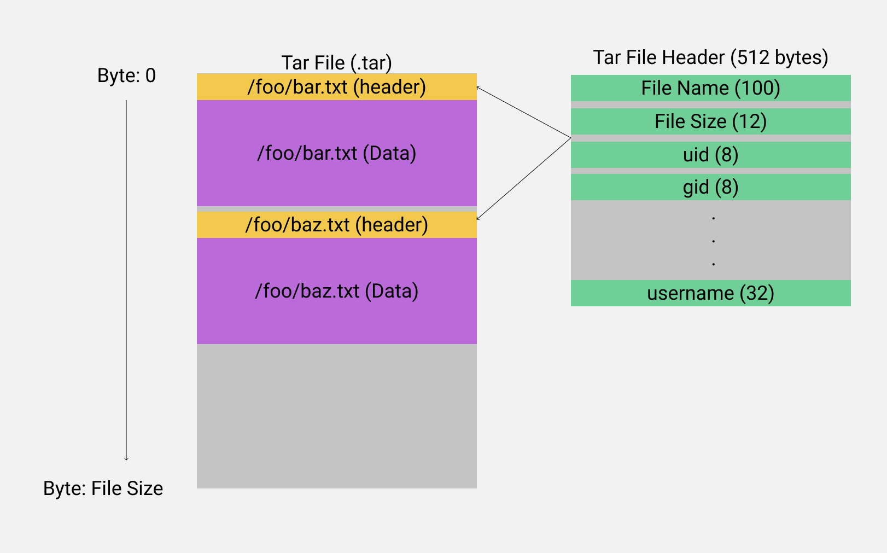

# COVT - Cloud optmized vector tiles

tar + Mapbox vector tiles + Tar index = :heart:


## Tar files

TAR files contain a collection of files stored sequentially into the file. With every file containing a 512 byte header just before the file data is stored.

This makes it very easy to add new files to a archive as move files can just be appended to the end, however this makes random reads impossible, as every file header would have to be read until the specific file wanted woudl be found 




TAR Index (.tari) is a JSON document containing the file location and size inside of a tar file. with this index a tar file can be randomly read.


```typescript
/** Mapping of path -> index records */
type TarIndex = Record<string, TarIndexFile>;

interface TarIndexFile {
    p: string; // Name of the file @see header.path
    o: number; // Offset to the start of the data
    s: number; // Number of bytes inside the file 
}
```

## Future investigation

1. Zip files

ZIP store their metadata at the end of the file, and so the metadata can be read with a single range request for the last 1+MB of data.
then individual files can be read directly from the ZIP.

See: https://github.com/tapalcatl/tapalcatl-2-spec

2. Combine tar with tari into a single tar

Having a single tar file greatly simplifies the distribution of the files, It would be quite simple to tar both the index (.tari) and data tar into another tar to combine the files into a single distribution